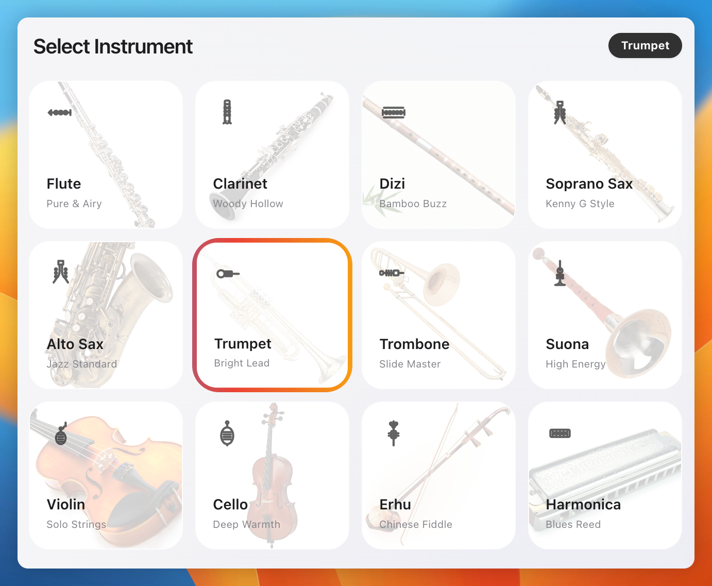
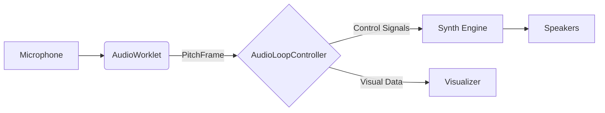

<div align="center">
  <h1>🎵 MAMBO Whistle</h1>
  <p>
    <strong>Makes Any Mouth Become Orchestra</strong>
  </p>
  <p>
    Real-time neural vocal synthesis engine. From browser prototype to embedded hardware instrument.
  </p>

  <p>
    <a href="#features">Features</a> •
    <a href="#architecture">Architecture</a> •
    <a href="#getting-started">Getting Started</a> •
    <a href="#hardware-vision">Hardware Vision</a> •
    <a href="#join-us">Join Us</a>
  </p>

  <br>

  
</div>

<br>

## 🚀 Introduction

**MAMBO Whistle** is a high-performance web application that transforms vocal input into synthesized instrument sounds in real-time. Unlike traditional pitch-to-MIDI converters, MAMBO uses a custom DSP pipeline running on `AudioWorklet` to achieve sub-20ms latency, preserving the nuanced expression of the human voice including vibrato, slides, and dynamics.

Whether you want to sound like a saxophone, a violin, or a futuristic synthesizer, MAMBO provides an immersive, "liquid" playing experience that feels like a real instrument.

**This is our working prototype.** We're building this technology into a standalone hardware instrument—a physical device you can hold, with tactile controls and zero-latency performance.

## ✨ Key Features

-   **Ultra-Low Latency Core**: Built on `AudioWorklet` with custom ring-buffer architecture, achieving <20ms end-to-end latency
-   **Dual Engine Architecture**:
    -   **Continuous Mode**: Tracks precise frequency changes for smooth slides and vibrato (Portamento / Glissando)
    -   **Legacy Mode**: Quantizes pitch to the nearest semitone for classic keyboard/sampler feel
-   **Pro-Grade DSP**:
    -   **YIN Algorithm**: Optimized implementation for accurate monophonic pitch detection down to 80Hz
    -   **FastFFT**: Custom O(N log N) FFT for spectral feature extraction (Brightness, Breathiness)
    -   **Liquid Visualizer**: 60fps hardware-accelerated canvas rendering for real-time pitch feedback
-   **Smart Auto-Tune**: Integrated pitch correction with adjustable strength and speed, supporting multiple scales (Chromatic, Major, Minor, Pentatonic, Blues)
-   **Expressive Synthesis**: Maps vocal volume and timbre to synth parameters (Cutoff, Resonance, Envelope) for dynamic expression
-   **Privacy First**: All processing happens locally in the browser. No audio data is ever sent to a server

## 🏗 Architecture

MAMBO follows a modern, decoupled architecture designed for performance and maintainability.

### Core Components

1.  **AudioIO Layer**: Robust abstraction over Web Audio API handling browser compatibility, sample rate conversion, and graceful degradation (Worklet → ScriptProcessor)
2.  **AudioWorklet Engine**: Runs in separate thread for DSP tasks:
    -   Pitch Detection (YIN)
    -   Spectral Analysis (FFT)
    -   Onset/Transient Detection
3.  **AudioLoopController**: Central nervous system receiving `PitchFrame` data from Worklet, orchestrating synthesis engine and visualizer
4.  **State Management**: Centralized Flux-like `StateStore` managing application state with unidirectional data flow
5.  **VisualizerManager**: Decoupled rendering engine drawing "Liquid Ribbon" visualization using `requestAnimationFrame`

### Data Flow



For detailed architecture documentation, see:
- [Architecture Overview](docs/ARCHITECTURE_OVERVIEW.md)
- [Technical Details](docs/TECHNICAL_DETAILS.md)
- [Performance Optimization](docs/PERFORMANCE.md)

## 🛠 Tech Stack

-   **Frontend**: Vanilla JavaScript (ES Modules) for maximum performance
-   **Styling**: Tailwind CSS + custom glassmorphism aesthetics
-   **Audio**: Web Audio API, Tone.js (synthesis graph management)
-   **DSP Algorithms**: YIN pitch detection, FastFFT spectral analysis
-   **Testing**: Vitest for unit and integration testing
-   **Tooling**: Node.js, npm

## 🏁 Getting Started

### Prerequisites

-   Node.js (v14 or higher)
-   npm (v6 or higher)
-   A modern web browser (Chrome/Edge recommended for best AudioWorklet performance)

### Installation

1.  **Clone the repository**
    ```bash
    git clone https://github.com/Team-Kazoo/mambo-whistle.git
    cd mambo-whistle
    ```

2.  **Install dependencies**
    ```bash
    npm install
    ```

3.  **Start the development server**
    ```bash
    npm start
    ```
    The application will be available at `http://localhost:3000`.

4.  **Run tests** (Optional)
    ```bash
    npm test
    ```

## 📖 Usage Guide

1.  **Select an Instrument**: Choose from presets like Flute, Saxophone, Violin, or Cello
2.  **Start Engine**: Click "Start Engine" and grant microphone permissions
    *   💡 **Pro Tip**: Use headphones to prevent feedback loops
3.  **Play**: Hum, sing, or whistle into your microphone. The visualizer reacts instantly
4.  **Adjust Settings**:
    *   **Auto-Tune**: Toggle pitch correction and select scale/key
    *   **Effects**: Add Reverb or Delay for atmosphere
    *   **Mode**: Switch between Continuous (smooth) and Legacy (stepped) modes

## 🛣 Roadmap

-   [x] **Phase 1: Core DSP & AudioWorklet** - Stable low-latency tracking
-   [x] **Phase 2: UI/UX Modernization** - Glassmorphism design & Liquid Visualizer
-   [ ] **Phase 3: Neural Audio Synthesis** - Implement RAVE/DDSP for photorealistic instrument emulation
-   [ ] **Phase 4: Embedded Hardware Prototype** - Port to NVIDIA Jetson / Raspberry Pi 5
-   [ ] **Phase 5: Connectivity** - MIDI export & VST/AU plugin wrapper
-   [ ] **Phase 6: Polyphonic Tracking** - Experimental multi-pitch voice tracking

## 🎛 Hardware Vision

### From Web App to Physical Instrument

We're transitioning this technology from a browser-based prototype to a **standalone hardware instrument**—a dedicated device with:

-   **Zero Boot Time**: Instant-on, embedded Linux/RTOS
-   **Sub-5ms Latency**: Optimized bare-metal audio drivers
-   **Physical Controls**: Tactile knobs, buttons, and OLED display
-   **Battery Powered**: Portable, wireless MIDI connectivity
-   **Neural Synthesis**: On-device RAVE/DDSP models for photorealistic sounds

**Target Platforms**: NVIDIA Jetson Nano/Orin Nano, Raspberry Pi 5, or custom ARM SoC with dedicated DSP coprocessor.

### Research Directions

We're actively researching:
-   **Neural Audio Synthesis**: RAVE (Realtime Audio Variational autoEncoder), DDSP (Differentiable Digital Signal Processing)
-   **Deep Learning Pitch Detection**: CREPE, SPICE, SwiftF0, FCPE for robust tracking in noisy environments
-   **Real-Time Inference Optimization**: Model quantization, TensorRT, ONNX Runtime for edge deployment
-   **Low-Level Audio**: ALSA/JACK drivers, lock-free ring buffers, SIMD optimization

For detailed research notes, see [docs/research/FUTURE_TECHNOLOGIES.md](docs/research/FUTURE_TECHNOLOGIES.md)

## 🤝 Contributing

We welcome contributions from the community! Whether it's a bug fix, new feature, or documentation improvement, your help is appreciated.

1.  Fork the Project
2.  Create your Feature Branch (`git checkout -b feat/AmazingFeature`)
3.  Commit your Changes (`git commit -m 'feat: Add some AmazingFeature'`)
4.  Push to the Branch (`git push origin feat/AmazingFeature`)
5.  Open a Pull Request

## 💼 Join Us - We're Hiring!

We're a small team building the future of expressive synthesis. We're looking for passionate engineers to help us transition from software to hardware.

### 🔧 Embedded Systems Engineer

**What You'll Do:**
- Lead the migration from Web Audio API to embedded Linux (Yocto/Buildroot) or RTOS (FreeRTOS/Zephyr)
- Design and optimize low-latency audio pipeline using ALSA/JACK on ARM platforms
- Port C++ DSP algorithms (YIN, FFT, synthesis engines) to embedded targets
- Evaluate and prototype on NVIDIA Jetson, Raspberry Pi 5, ESP32-S3, or custom SoC
- Implement lock-free audio buffers, DMA transfers, and SIMD optimization (NEON/SVE)
- Interface with audio codecs (I2S/TDM), MIDI controllers, and display hardware

**What We're Looking For:**
- Strong C/C++ programming experience (C++17/20, STL, modern idioms)
- Deep understanding of embedded Linux development (kernel modules, device trees, cross-compilation)
- Experience with real-time systems and RTOS concepts (scheduling, interrupt handling)
- Familiarity with audio processing fundamentals (sample rates, buffers, latency)
- Bonus: Experience with ARM architecture, DSP optimization, or audio hardware design

**Why Join:**
- Work on cutting-edge music technology at the intersection of DSP, ML, and hardware
- Own the entire embedded stack from boot to audio output
- Flexible remote work, competitive compensation
- Your work will ship in a physical product used by musicians worldwide

---

### 🎨 Industrial Designer / Product Designer

**What You'll Do:**
- Define the physical form factor, ergonomics, and aesthetic language of the instrument
- Design tactile control interfaces (knobs, buttons, touch surfaces)
- Create enclosures optimized for manufacturing (injection molding, CNC, 3D printing)
- Collaborate with engineers on PCB layout constraints and thermal management
- Prototype using CAD (Fusion 360, SolidWorks) and rapid prototyping techniques
- Conduct user testing and iterate on design based on musician feedback

**What We're Looking For:**
- Portfolio demonstrating consumer electronics or musical instrument design
- Proficiency with 3D CAD tools and mechanical design principles
- Understanding of manufacturing processes and material selection
- Ability to balance aesthetics with functionality and cost constraints
- Bonus: Experience with audio equipment, synthesizers, or musical interfaces

**Why Join:**
- Shape the look and feel of a new category of musical instrument
- Bridge the gap between software innovation and physical product
- Work closely with a small, nimble team where your decisions matter
- See your designs go from sketch to production

---

### 🧠 Neural Audio Research Engineer

**What You'll Do:**
- Optimize deep learning models (RAVE, DDSP, WaveNet) for real-time inference on edge devices
- Implement model quantization (INT8/FP16), pruning, and knowledge distillation
- Port models to TensorRT, ONNX Runtime, or Arm Compute Library
- Experiment with novel neural synthesis architectures for low-latency generation
- Profile and optimize inference pipelines to meet <5ms latency targets
- Train custom models on curated audio datasets for specific instrument timbres

**What We're Looking For:**
- Strong background in deep learning (PyTorch/TensorFlow) and audio ML
- Experience deploying models on edge devices (Jetson, RPi, mobile SoCs)
- Understanding of neural audio synthesis techniques (VAEs, GANs, diffusion models)
- Familiarity with model optimization frameworks (TensorRT, ONNX, TFLite)
- Bonus: Experience with real-time audio systems or published research in neural audio

**Why Join:**
- Push the boundaries of neural synthesis on resource-constrained hardware
- Collaborate with DSP engineers to integrate ML into a real-time audio pipeline
- Access to GPUs and compute resources for training and experimentation
- Contribute to open-source neural audio tools and research

---

### 📧 How to Apply

If you're excited about music technology, embedded systems, or hardware design, we'd love to hear from you!

**Contact**: [zwangnv@connect.ust.hk](mailto:zwangnv@connect.ust.hk)

**Include**:
- Your resume/CV
- GitHub profile or portfolio (if applicable)
- Brief note on why you're interested and what excites you about this project

**Location**: Remote-friendly, with preference for Hong Kong / Shenzhen / Bay Area

---

## 📄 License

This project is licensed under the **GNU Affero General Public License v3.0 (AGPL-3.0)**.

This means:
- ✅ You can use, modify, and distribute this software
- ✅ You must open-source any modifications if you deploy it as a web service
- ✅ Commercial use is allowed, but derivative works must also be AGPL-3.0
- ❌ No warranty or liability is provided

For commercial licensing options (proprietary use without AGPL restrictions), please contact [zwangnv@connect.ust.hk](mailto:zwangnv@connect.ust.hk).

See [LICENSE](LICENSE) for full terms.

---

## 👥 Core Team

We're a small, dedicated team passionate about music technology and audio engineering.

For inquiries, collaboration, or investment opportunities, reach out at [zwangnv@connect.ust.hk](mailto:zwangnv@connect.ust.hk).

---

<div align="center">
  <sub>Built with ❤️ using Web Audio API. Evolving into hardware.</sub>
</div>
